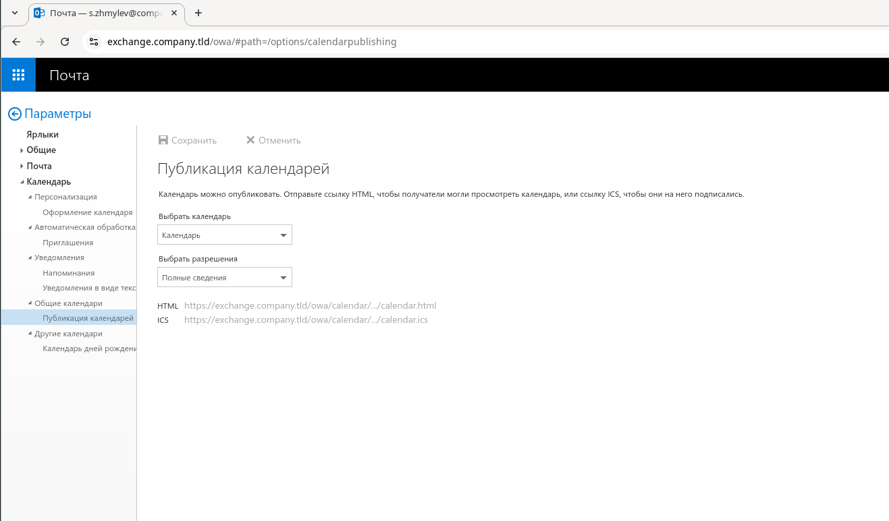
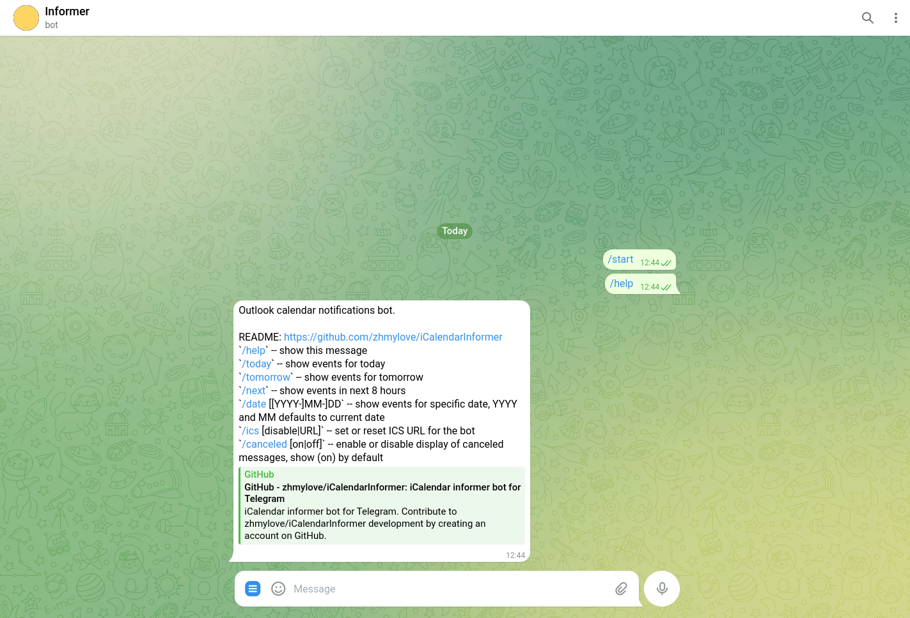
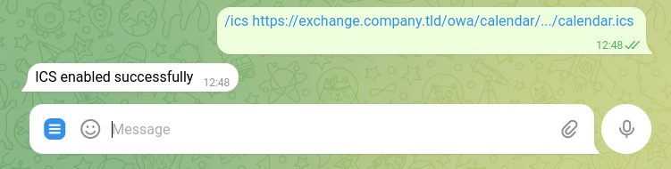
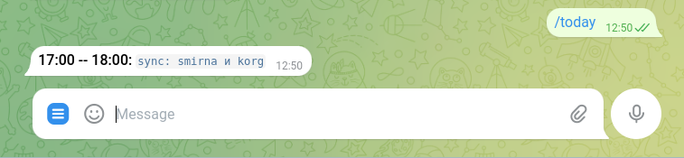

# iCalendarInformer -- a bot for sending notifications about your outlook events

Sometimes it's handy to receive meeting reminders directly in Telegram.
That's why I created a bot that can parse your Outlook calendar and notify you about upcoming events.
Currently, the bot only supports the ICS calendar format.
I already have a working proof of concept with HTTPS, but it's not yet production-ready,
mainly because the code still heavily relies on ICS in many places.

## How to Set Up

1. First, create a unique URL for your calendar in OWA:
   Go to `https://exchange.company.tld/owa/#path=/options/calendarpublishing`, ensure that access is allowed, and
   copy the ICS URL.
   

2. Subscribe to the bot:
   

3. Send the copied URL to the bot:
   

The bot will now notify you about your events.
You can also manually request information (see `/help` for details):

